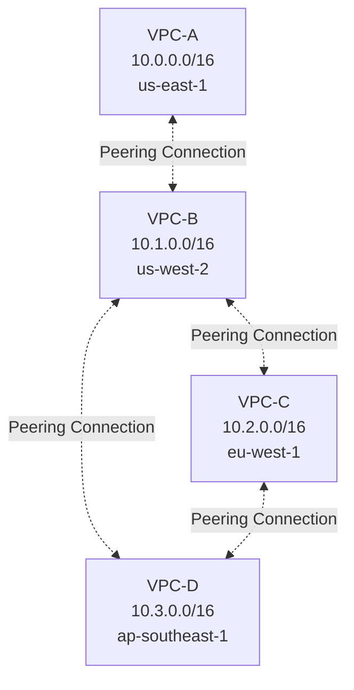
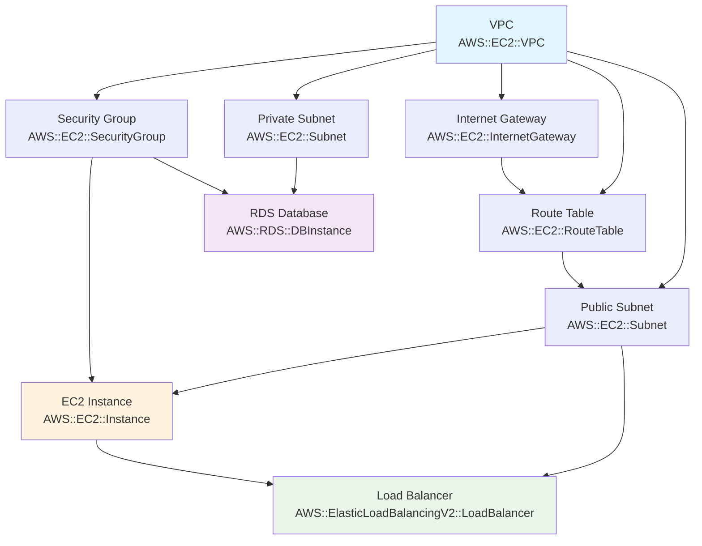
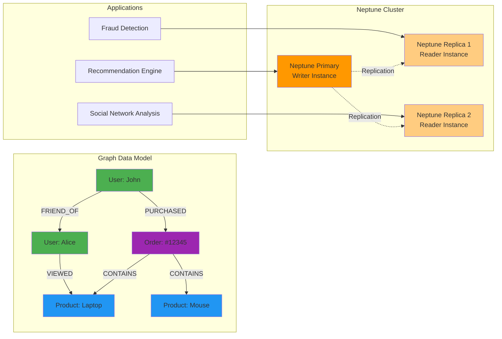
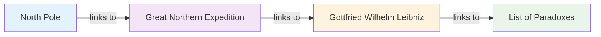
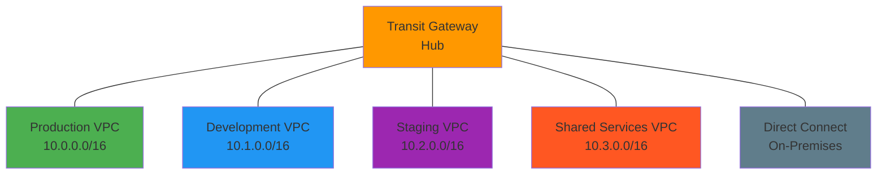

# AWS Graph-Based Concepts

## 1. Connected VPCs - Bidirectional Graph

## 2. CloudFormation Dependency Graph

## 3. Amazon Neptune Graph Database

## 4. Wikipedia Pages Connection Graph

## 5. AWS Transit Gateway Hub-and-Spoke Architecture

